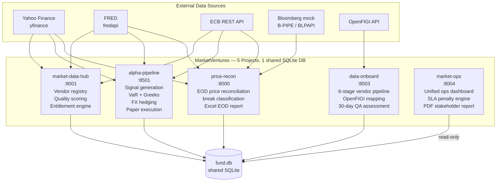

# MarketVentures — GBP Fund Market Data Portfolio

[](https://github.com/KeepingJones/MarketVentures/actions/workflows/ci.yml)

A 5-project Python monorepo demonstrating the full market data lifecycle of a GBP-denominated fund — from raw price ingestion to paper trading to stakeholder reporting. Built to show hiring managers at prop trading firms and market data vendors what production-grade data engineering looks like in Python.

**PAPER_TRADE_MODE = True is hardcoded across all projects. No live capital. No live broker credentials.**

---

## System architecture



---

## Projects

| # | Project | Port | What it does | Stack |
|---|---|---|---|---|
| 1 | [price-recon](price-recon/) | 8000 | Multi-source EOD price reconciliation, break classification by root cause, liquidity-adjusted tolerances, Excel report | FastAPI · Chart.js · yfinance · FRED · ECB · Bloomberg mock |
| 2 | [market-data-hub](market-data-hub/) | 8001 | Vendor registry, live quality scoring, entitlement engine (display-only / derived / execution-licensed), cost allocation by desk | FastAPI · Chart.js · Ollama |
| 3 | [alpha-pipeline](alpha-pipeline/) | 8501 | 5-strategy signal engine, parametric VaR, QuantLib Greeks, IRP FX forwards, Sharpe/Sortino, Alpaca paper execution | LangGraph · Streamlit · QuantLib · Alpaca Paper API |
| 4 | [data-onboard](data-onboard/) | 8003 | 6-stage vendor onboarding pipeline, OpenFIGI identifier mapping, 30-day QA assessment, alt data extraction | FastAPI · OpenFIGI · Ollama |
| 5 | [market-ops](market-ops/) | 8004 | Unified ops dashboard aggregating all 4 projects, SLA penalty engine, ReportLab PDF stakeholder report | FastAPI · Chart.js · ReportLab |

---

## Why not KDB+?

KDB+/q is the industry standard for tick data at sub-millisecond latency. This portfolio uses Python + SQLite deliberately:

| Concern | KDB+/q | This portfolio |
|---|---|---|
| **Hiring signal** | Rare outside top-tier HFT | Demonstrates Python data engineering, which most fund roles actually use day-to-day |
| **Cost** | £20k+/seat/year | Free — meaningful portfolio work without a firm's licence |
| **Multi-project integration** | Separate q databases per service | Shared SQLite `fund.db` — all 5 projects read/write the same schema, demonstrating cross-service data architecture |
| **Testability** | q test frameworks are limited | pytest with seeded PRNG, in-memory SQLite fixtures, 100+ tests across all projects |
| **EOD/daily use case** | Overkill for daily snapshots | Python + SQLite is the right tool: no latency requirements, simpler ops, easier to extend |

A firm using KDB+ for intraday tick storage would still use Python for exactly this kind of EOD reconciliation, catalogue management, onboarding workflow, and reporting. This portfolio targets those roles.

---

## Shared database schema

All 5 projects write to `fund.db` at the repo root. Key tables:

| Table | Owner | What it stores |
|---|---|---|
| `price_breaks` | price-recon | EOD break log: ticker, sources, severity, cause |
| `vendors` | market-data-hub | Vendor registry with SLA and cost |
| `quality_scores` | market-data-hub | Per-vendor quality scores (freshness/completeness/accuracy) |
| `positions` | alpha-pipeline | Open positions with MV, PnL, liquidity tier |
| `portfolio_snapshots` | alpha-pipeline | Daily NAV, VaR, Sharpe, Sortino, drawdown |
| `fx_forwards` | alpha-pipeline | Active IRP-priced FX forward hedges |
| `vendor_pipeline` | data-onboard | Vendor onboarding stage progress |
| `ops_sla_events` | market-ops | SLA breach events for penalty calculation |

---

## Quick start (all services)

```bash
git clone https://github.com/KeepingJones/MarketVentures.git
cd MarketVentures

# Option A — Docker Compose (all services + shared DB)
docker compose up

# Option B — Run individually
pip install -r requirements.txt

# Each project has its own quickstart in its README
```

---

## Running all tests

```bash
# price-recon (23 tests)
cd price-recon && python -m pytest tests/ -v && cd ..

# alpha-pipeline (45 tests)
cd alpha-pipeline && python -m pytest tests/ -v && cd ..

# market-data-hub (35 tests)
cd market-data-hub && python -m pytest tests/ -v && cd ..

# data-onboard (28 tests)
cd data-onboard && python -m pytest tests/ -v && cd ..

# market-ops (24 tests)
cd market-ops && python -m pytest tests/ -v && cd ..
```

---

## Safety

- `PAPER_TRADE_MODE = True` hardcoded in every `config.py`
- No `.env` files committed — see each project's `.env.example`
- Alpaca keys use the paper trading endpoint (`paper-api.alpaca.markets`) only
- `fund.db` is excluded from git via `.gitignore`

---

## Contact

Ewan Jones · [ewanjk123@gmail.com](mailto:ewanjk123@gmail.com) · [github.com/KeepingJones](https://github.com/KeepingJones)
