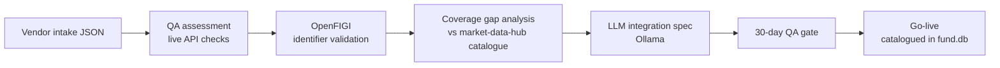

# data-onboard — Vendor Data Onboarding & Integration Workflow


**Business problem:** Onboarding a new data vendor is 8 weeks of email chains with no structured process. Things fall through the cracks at go-live. A vendor passes legal but fails the technical integration. Another passes technical but has poor data quality that only shows up in production.


`data-onboard` formalises this into a 6-stage structured pipeline: intake → coverage gap analysis → legal/compliance check → tech spec → 30-day QA period → go-live sign-off. Vendors that don't meet QA thresholds don't go live.

---

## Architecture



---

## What it demonstrates

- **6-stage onboarding pipeline** — each stage has a pass/fail gate with audit trail in `fund.db`
- **Coverage gap analysis** — new vendors checked against existing catalogue; "low value add" recommendation if all asset classes are already covered
- **OpenFIGI identifier mapping** — vendor tickers resolved to Bloomberg FIGIs (openfigi.com free API), flagging unresolvable instruments before go-live
- **LLM integration spec generation** — Ollama generates a structured integration document (vendor overview, API auth, data format, testing plan, go-live checklist) from the intake form
- **30-day QA assessment** — measures completeness (≥95%), latency (≤30 min), accuracy vs Yahoo benchmark (≥99%); simulated mode for demo vendors
- **Alt data ingestion pipeline** — PDF documents (earnings transcripts, SEC filings, research reports) → LLM extraction → structured JSON signal output (`ticker`, `sentiment`, `revenue_guidance`, `earnings_surprise`, `confidence`)
- **Pipeline stage audit log** — every stage transition recorded with timestamp, outcome, and notes

---

## Pipeline stages

```
Vendor submits intake form
         │
    [1] intake ──────────────────── validate required fields
         │
    [2] gap_analysis ─────────────── coverage vs existing catalogue
         │                           → proceed / low_value_add
    [3] legal_check ──────────────── licence type, GDPR, redistribution rights
         │
    [4] tech_spec ────────────────── LLM-generated integration document
         │
    [5] qa_period ────────────────── 30-day live assessment:
         │                             completeness ≥ 95%
         │                             latency ≤ 30 min
         │                             accuracy ≥ 99%
         │
    [6] go_live ──────────────────── sign-off → add to market-data-hub catalogue
```

---

## QA thresholds

| Metric | Pass threshold | Why |
|---|---|---|
| Completeness | ≥ 95% fields populated | Sparse data breaks VaR inputs silently |
| Latency | ≤ 30 min stale | EOD risk run requires same-day prices |
| Accuracy | ≥ 99% vs benchmark | >1% deviation invalidates stress tests |

---

## Acceptance criteria

- [x] 6-stage pipeline with stage gate logic
- [x] Intake validation (all required fields enforced)
- [x] Coverage gap analysis vs existing catalogue
- [x] OpenFIGI ticker → FIGI resolution (batched, 10 per request)
- [x] LLM integration spec via Ollama
- [x] 30-day QA assessment with pass/fail thresholds
- [x] Alt data extraction pipeline (PDF → LLM → structured JSON)
- [x] All stages logged in shared fund.db with audit trail

---

## Quick start

```bash
# 1. Clone and set up
git clone https://github.com/KeepingJones/MarketVentures.git
cd MarketVentures/data-onboard
pip install -r requirements.txt

# 2. Configure environment
cp .env.example .env
# Edit .env — OPENFIGI_API_KEY is optional (free tier works without it)

# 3. Start API
python main.py
# Dashboard: http://localhost:8003

# 4. Submit a vendor for onboarding (example)
curl -X POST http://localhost:8003/api/onboard \
  -H "Content-Type: application/json" \
  -d '{"vendor_name":"Acme Data","vendor_id":"acme","contact_email":"data@acme.com","api_endpoint":"https://api.acme.com","asset_classes":["equity","crypto"]}'
```

---

## Running tests

```bash
cd MarketVentures/data-onboard
python -m pytest tests/ -v
```

Tests cover intake validation, gap analysis logic, QA threshold pass/fail criteria, pipeline stage ordering, and alt data schema shape.

---

## Safety

`PAPER_TRADE_MODE = True` hardcoded in `config.py`. Onboarding pipeline only — no order routing, no live capital.

---

## Part of the GBP fund portfolio ecosystem

| # | Project | What it adds |
|---|---|---|
| 1 | price-recon | Price validation, break detection, EOD Excel reporting |
| 2 | market-data-hub | Data catalogue, vendor registry, quality scoring |
| 3 | alpha-pipeline | Signal generation, risk, FX hedging, paper execution |
| 4 | **data-onboard** (this) | Vendor onboarding workflow, coverage gap analysis |
| 5 | market-ops | Unified operations dashboard, stakeholder PDF report |

---

## Stack

Python · FastAPI · SQLite (shared fund.db) · OpenFIGI API · Ollama · yfinance

